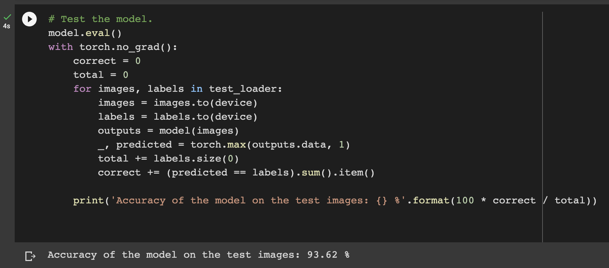

# resnet_liudanya_zhangshihong

## Project status

### Milestones
- [ ] 17.04.2023 - 30.04.2023
Built resnet50 by ourselves, and use that to train on CIFAR10. It works well. The correspoinding result are shown in folling part - *Results*.

## Environment

Based on python 3.9, and we use GPU from Google Colab service to complete our trainning process.

## Code structure

- [ ] Import necessary libraries

```python
import torch
import torchvision
```

- [ ] Device configuration

We subscribe the service from Google Colab, so our network was trained in google colab with the following line.

```python
device = torch.device('cuda' if torch.cuda.is_available() else 'cpu')
```
- [ ] Prepare the data

```python
train_dataset = torchvision.datasets.CIFAR10('data/CIFAR/', download=True, train=True, transform=transform_train)
test_dataset = torchvision.datasets.CIFAR10('data/CIFAR/', download=True, train=False, transform=transform_test)
```

We set the download argument to "True", then we don't need to download CIFAR-10 by ourselves. Then we transfrom the data with operations of pad, random horizontal flip, random crop...

- [ ] Define the residual block

Convolution -> Batch Normalization -> ReLU -> Convolution -> Batch Normalization -> Downsample

Also, the forward process.

- [ ] Define the resnet 50

Based on 3, 4, 6, 3 bottleneck structure, we built resnet50 architecture by ourselves. Then we got output channels as 64, 128, 256, 512.

Also, the forward process.

- [ ] Loss funciton & optimizer

Loss fucntion: Cross entropy Loss.
Optimizer: Adam.

- [ ] Train the data

Forward process -> Backward process -> Optimize

- [ ] Validating process

Similar as training process, but the model was not be updated. Validating process was just for evaluating the performance.

- [ ] Testing process

Set the evaluation mode -> Forward process -> Calculate the number of correct predictions (by comparing the predicted labels with the actual labels) -> Compute the accuracy (by dividing the number of correct predictions by the total number of test samples)

## Results

Our testing accuracy was over 93% at last.



The weights file was included in ./Results


## Authors 

Danya Liu, (Danya.Liu@tum.de)<br>
Shihong Zhang, (Sh.Zhang@tum.de)
